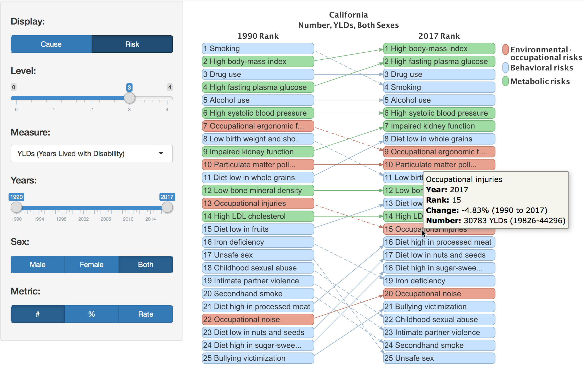

Through an internship with the California Department of Public Health, I have recently been contributing to the [California Community Burden of Disease Engine](https://cdph.ca.gov/communityburden), a data visualization tool built with R Shiny that provides a lens into the relation of place and health disparities. My primary role has been extracting, analyzing, and visualizing health data created by the [Institute for Health Metrics Evaluation](http://www.healthdata.org/) (IHME).

The first visualization I created with IHME data was an arrow diagram that shows rank change between available years with widgets for Cause/Risk, Hiearchy Level, Measure, Sex and Metric:

When I first started using IHME's API, I was using IHME's GBD 2016 HealthData API version

