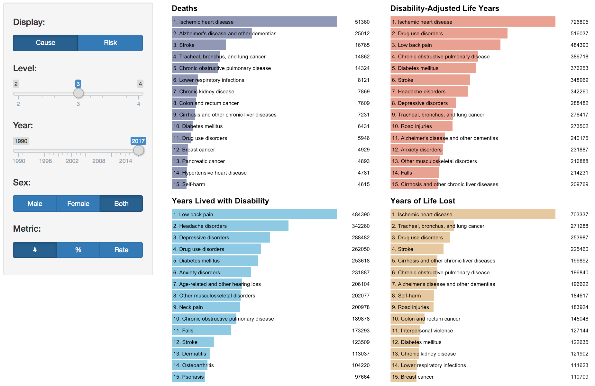

Through an internship with the California Department of Public Health, I have recently been contributing to the [California Community Burden of Disease Engine](https://cdph.ca.gov/communityburden), a data visualization tool built with R Shiny that provides a lens into the relation of place and health disparities. My primary role has been extracting, analyzing, and visualizing health data created and made accessible by IHME ([The Institute for Health Metrics Evaluation](http://www.healthdata.org/)).

The first chart I created is a series of simple bar charts that show the top causes or risks for four common measures:


```{r}
# Source: http://www.htmlwidgets.org/showcase_plotly.html
library(plotly)
p <- ggplot(data = diamonds, aes(x = cut, fill = clarity)) +
            geom_bar(position = "dodge")
ggplotly(p)
```


The first visualization I created with IHME data is a diagram that shows the change in rankings between two years of causes or risks:


When I first started using IHME's API, I was using IHME's GBD 2016 HealthData API version


