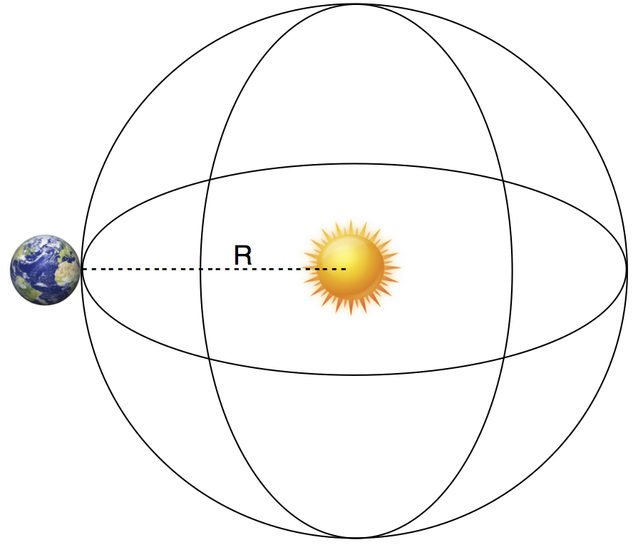
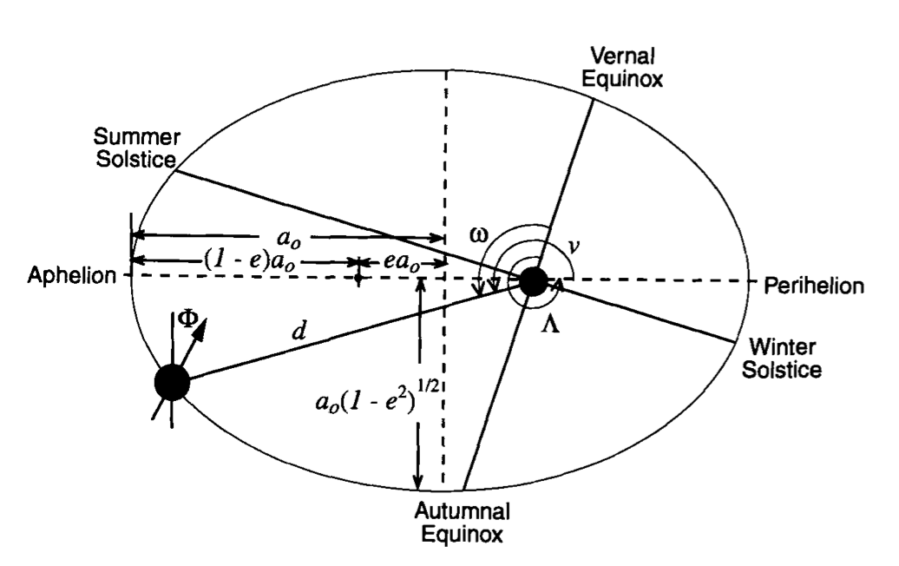
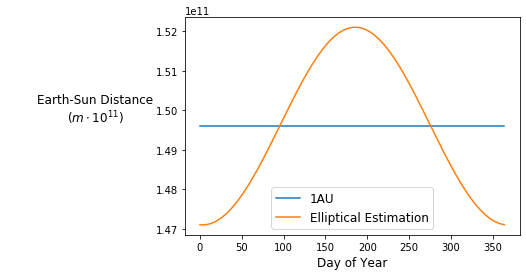
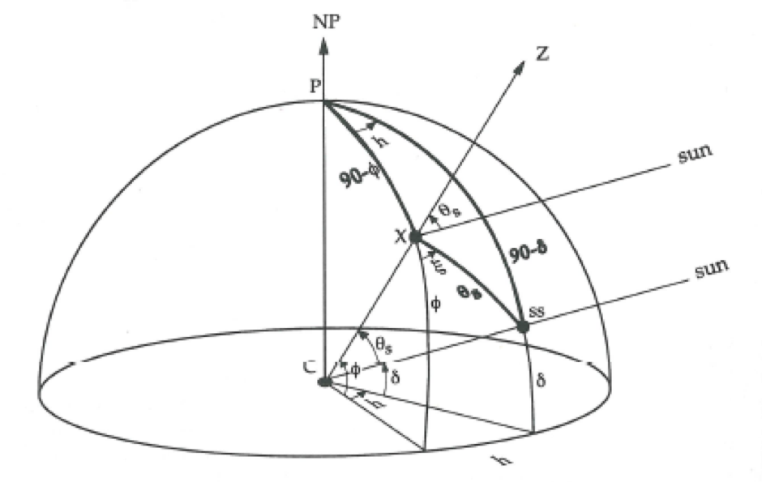
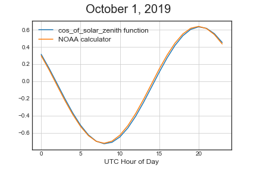
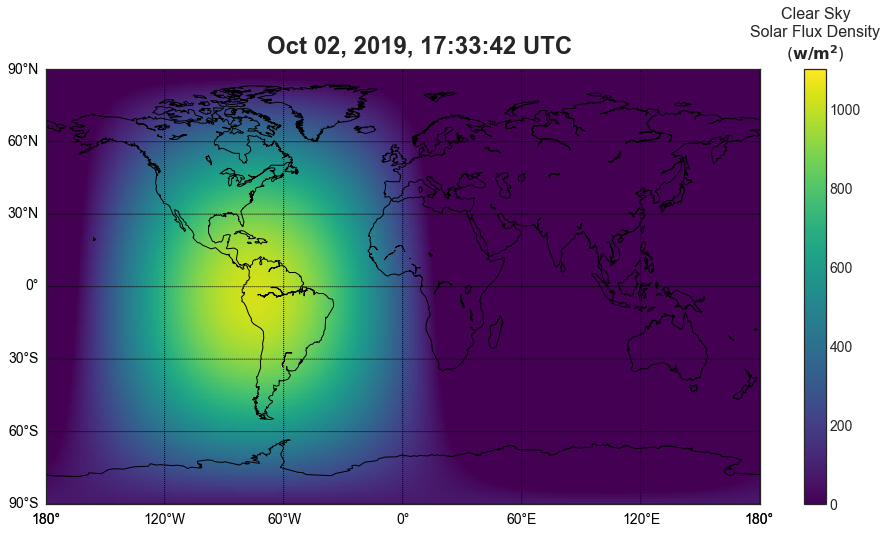

## *Equations, Explanations, Code, and Visualizations*



**Skip to:**
1. [Equations and Explanations](#equations)  
    1.1 [Solar Constant](#solar-constant)  
    1.2 [Solar Luminosity](#luminosity)  
    1.3 [Total Solar Irradiance (TSI)](#tsi)  
    1.4 [Earth-Sun Distance](#distance)  
    1.5 [Solar Zenith Angle](#zenith)  
2. [Code for Solar Flux Density Calculation](#code)
3. [Visualizations](#viz)  
    3.1 [Animated Visualizations](#anim)

## Overview 
This post walks through how to *approximate* Solar Flux Density for anywhere on Earth, at any time. I will walk through the concepts and equations necessary for making Solar Irradiance predictions, then make some visualizations (like the one above) using the calculations.

***Caveat emptor***:  Many of the following calculations are *approximations*! The purpose here is educational, and simplifications allow for better understanding of the factors at play (and near-accurate results). I will specify when I make any assumptions.  More rigorous calculations are often exceedingly complicated, and I will provide references to them where appropriate.

## Solar Flux Density is a Measure of Irradiance
Solar Irradiance (SI) is a measure of how much power per unit area is reaching a surface from the Sun. Understanding and predicting SI is crucial for many things, including climate modeling and making [**solar panel energy generation predictions**]().

**Note:** Solar Flux Density is an *instantaneous* measure of solar irradiance (power per area), compared to *Solar Irradiation*, which is measured over time (energy per area).  As such, we will assume clear skies for calculations because it is impossible to predict cloud coverage at a given instant.  I will soon make a post about [incoorporating cloud cover data into predicting *Solar Irradiation*]().


## Solar Flux Density Equation  <a name="equations"></a>


The equation for calculating the **Solar Flux Density $(Q)$** on a surface *tangent to Earth* includes 4 main components. I will go into more detail about how to calculate each component below:

**1.  The Solar Constant** represents the Sun's measured brightness.  
**2.  The Earth-Sun distance**, which is based on time of year.$\left( \frac{\overline{d}}{d} \right)^2$  
**3.  The Solar Zenith Angle** represents the angle at which sunlight is striking the Earth in our location, which is based on latitude, season, and time of day.$\cos{\theta_s}$  
**4. Transmittance** represents the ratio of solar radiation that passes through the atmosphere and reaches a point on the Earth (due to Earth's atmosphere, clouds, and other obstructions).

$$Q = {S_0} \left( \frac{\overline{d}}{d} \right)^2\cos{\theta_s}\cdot T\tag*{Equation 1}$$

where  
$Q=$ **Solar Flux Density** $(\frac{W}{m^2})$ onto a plane tangent to the Earth.  
$S_0=$ the **Solar Constant** $(\frac{W}{m^2})$, the mean solar flux density at a distance of 1AU, measured perpendicular to the incoming sunlight (without clouds or atmosphere).  
$d=$ **current distance** $(m)$ from the Earth to the center of the Sun.  
$\overline{d}=$ **average distance** $(m)$ from the Earth to the center of the Sun (1AU plus the radius of the sun).  
$\theta_s=$ **Solar Zenith Angle**, the angle between incoming sunlight and the zenith.  
$T=$ **Transmittance**, the ratio of irradiance that actually reaches the Earth.

### 1. The Solar Constant $(S_0)$ <a name="solar-constant"></a>

The Solar Constant is a measure of mean **Total Solar Irradiance (TSI)**.  It is the average brightness of the Sun from our perspective on Earth, and is measured at a distance of one astronomical unit (AU) from the Sun (the mean distance from the Earth to the Sun). $S_0$ is about 1,361 $W/m^2$ (as measured by satellites).  

*Assumption*: $S_0$ is constant.  It actually changes by about 0.1% throughout the 11 year solar cycle.[$^1$](https://ui.adsabs.harvard.edu/abs/2011GeoRL..38.1706K/abstract)

```python
SOLAR_CONSTANT = 1361
```

### Total Solar Irradiance (TSI)
TSI is just the first 2 terms from Equation 1.  It is the irradiance that reaches a surface perpendicular to the sunlight without any atmospheric obstruction or scattering: 
$$TSI = {S_0} \left( \frac{\overline{d}}{d} \right)^2\tag*{Equation 2}$$

TSI is calculated using the [inverse-square law](https://en.wikipedia.org/wiki/Inverse-square_law) to account for the current Earth-to-Sun distance.  To understand why the inverse-square law works here, follow me on an educational detour into calculating the Solar Luminosity and the derivation of Equation 2. Or don't, and skip ahead to [calculating the distance ratio](#distance).


### The Solar Luminosity $(L_☉)$  <a name="luminosity"></a>
The Solar Constant is closely related to the **Solar Luminosity $(L_☉)$**, another constant (again, not actually a constant as it changes slightly with solar cycles) that represents the total power output of the Sun.

To conceptualize the Solar Luminosity, it is useful to imagine a giant sphere surrounding the Sun, which is the perfect size so that the Earth is on its surface:

<div style="text-align:center"></div>

$L_☉$ radiates equally in all directions, so the total value of $L_☉$ is spread evenly across the surface of the imaginary sphere.  Thus, we can calculate $L_☉$ by multiplying the observed brightness $(S_0)$ by the surface area of the sphere $(SA)$:

$$L_☉ \  (watts) = TSI \ (watts/m^2) \cdot SA \ (m^2) \tag*{Equation 3}$$ 

When the observed brightness is $S_0$, the Earth is 1AU from the Sun, so:

$$L_☉ = S_0\times4\pi R^2\tag*{Equation 4}$$ 
where  $R = (1AU+\text{radius of Sun})$

We can use Equation 4 to calculate $L_☉$:


```python
import numpy as np

SOLAR_CONSTANT = 1361
R_SUN = 6.957e+8
AU = 149597870700

def calculate_surface_area():
    radius_sphere = R_SUN + AU
    return 4*np.pi*radius_sphere**2

def calculate_solar_luminosity():
    return SOLAR_CONSTANT * calculate_surface_area()

SOLAR_LUMINOSITY = calculate_solar_luminosity()
print(SOLAR_LUMINOSITY)
```
    3.8632142509266845e+26

The [Solar Luminosity](https://en.wikipedia.org/wiki/Solar_luminosity) is about $3.86\times10^{26} watts$!

### General Equation for TSI  <a name="tsi"></a>

We can also use Equation 3 to solve for $TSI$ when the Earth is any distance $d$ from the Sun:

$$TSI = \frac{L_☉}{SA} = \frac{L_☉}{4\pi{d}^2}\tag*{Equation 5}$$
where  
$d =$ current **distance** from the Earth to the center of the Sun.

Combining and simplifying Equations 4 and 5, we get the general equation for TSI:

$$TSI= S_0\left(\frac{\overline{d}}{d}\right)^2\tag*{Equation 6}$$
where  
$\overline{d} = (1AU+\text{radius of Sun})$ -- the mean Earth-Sun distance.

## 2. Distance From the Sun $\left(\frac{\overline{d}}{d}\right)^2$  <a name="distance"></a>

The Earth's orbit is not, in fact, a true ellipse, as the Earth's position is constantly being affected by the gravitational pull of other celestial objects. This makes it very difficult to predict the actual Earth to Sun distance precisely, but we can use Kepler's First Law to make approximations that are good enough for our purposes.

*Assumption*: Earth's orbit is elliptical.  A more precise value can be achieved through numerical integration data such as [NASA's DE430 data](https://naif.jpl.nasa.gov/pub/naif/generic_kernels/spk/planets/de430_and_de431.pdf), which contains polynomial equations with many coefficients which have been derived from observations and sattelite data.

### Approximating Earth-Sun Distance with Kepler's First Law
We can make a good approximation for the distance from the Sun by using [Kepler's first law](https://en.wikipedia.org/wiki/Kepler%27s_laws_of_planetary_motion#First_law_of_Kepler_(law_of_orbits)):

<div style="text-align:right"></div>
$$\textit{Diagram of Earth’s elliptical orbit about the Sun with some associated parameters.}$$

To calculate the Earth-Sun distance at any time $(d)$:

$$d = \frac{a_0(1-e^2)}{1+e\cos v}\tag*{Equation 2}$$
where  
**$a_o=$ semi-major axis**  
**$e=$ eccentricity** of the Earth's orbit  
**$v=$ angle from perihelion** (or the *true anomaly*)

$$v = \frac{2\pi n}{365.265}\tag*{Equation 3}$$
where  
**$n=$ number of days from perihelion** (day of the year when the Earth is closest to the Sun)  
and 365.265 is the number of days in a [sidereal year](https://en.wikipedia.org/wiki/Sidereal_year)

*Assumptions*:  We are assuming Earth's orbit is elliptical, so we are also assuming that the constants defined below are actually constants (e.g. that perihelion occurs on January 3rd. It actually fluctuates from ~January 2nd to ~January 5th.[$^2$](http://www.astropixels.com/ephemeris/perap2001.html))

The code:

```python
DAYS_IN_YEAR = 365.265
PERIHELION_DAY = 3
SEMI_MAJOR_AXIS = 1.496e11+10
ECCENTRICITY = 0.0167

def days_from_perihelion(day_of_year):
    '''Returns number of days from January 3rd based on day_of_year input.'''
    n = abs(day_of_year - PERIHELION_DAY)
    return (DAYS_IN_YEAR - n) if n > (DAYS_IN_YEAR/2) else n

def angle_from_perihelion(day_of_year):
    '''Returns angle from perihelion day based on day_of_year input.'''
    days_from_p = days_from_perihelion(day_of_year)
    return (2*np.pi*days_from_p)/DAYS_IN_YEAR

def earth_sun_distance_kepler(day_of_year):
    '''Returns Earth-Sun distance using Keplerian approximation.'''
    angle_from_p = angle_from_perihelion(day_of_year)
    return SEMI_MAJOR_AXIS*(1 - ECCENTRICITY**2)/(1 + ECCENTRICITY*np.cos(angle_from_p))
```

We can visualize the output of `earth_sun_distance_kepler` by graphing $d$ over one year compared to 1AU:

```python
import matplotlib.pyplot as plt
%matplotlib inline
NUMBER_DAYS = 365

days = [day for day in range(NUMBER_DAYS)]
distance = [earth_sun_distance_kepler(day) for day in days]
au_distance = [AU]*NUMBER_DAYS

# Create the plot
plt.plot(days, au_distance, label = '1AU')
plt.plot(days, distance, label = 'Elliptical Estimation')

plt.xlabel('Day of Year', fontsize=12)
plt.ylabel('Earth-Sun Distance $(m\cdot10^{11})$',
           rotation=0, wrap=True, fontsize=12, labelpad=60)
plt.legend(fontsize=12)
```



The mean Earth-Sun distance is 1 Astronomical Unit, so our function for calculating the "distance ratio" $\left(\frac{\overline{d}}{d}\right)^2$ is as follows:

```python
AU = 149597870700
R_SUN = 6.957e+8

def earth_sun_distance_ratio(day_of_year):
    '''Return the square of the mean Earth-Sun distance to current Earth-Sun distance ratio.'''
    return ((R_SUN + AU) / earth_sun_distance_kepler(day_of_year))**2
```

## 3. Solar Zenith Angle - $\cos \theta_s$  <a name="zenith"></a>

The Solar Zenith Angle is the angle between the incoming sunlight and the zenith ($Z$, the vector pointing directly above a particular location).  For a location $X$, the Solar Zenith Angle is $\theta_s$:


$$\text{Figure 4: }\textit{Spherical geometry for Solar Zenith Angle calculation}$$

Using results from [spherical trigonometry](https://en.wikipedia.org/wiki/Spherical_trigonometry), we calculate $\cos \theta_s$ using the following formula:

$$ \cos \theta_s = \sin \Phi \sin \delta + \cos \Phi \cos \delta \cos h \tag*{Equation 4}$$

where  
$\theta_s=$ is the **solar zenith angle**  
$h=$ is the **hour angle**, in the *local solar time*  
$\delta=$ is the current **declination of the Sun**  
$\Phi=$ is the local **latitude**  

When the Sun is directly overhead, $\theta_s$ will be $0^{\circ}$ and $\cos\theta_s$ will be 1. If $\cos\theta_s$ is negative, then the sun is below the horizon.  Sunrise and Sunset occur when $\theta_s$ is $90^{\circ}$.  The Python code for predicting $\cos\theta_s$ is as follows:

```python
AXIS_TILT = 23.45
EQUINOX_DAY = 284
DAYS_IN_YEAR = 365.265
NUM_LONS = 360
DEGREES_PER_HOUR = 15

def declination(day):
    '''Return the declination angle of a given day.'''
    return np.radians(AXIS_TILT)*np.sin(np.radians((NUM_LONS/DAYS_IN_YEAR)*(day+EQUINOX_DAY)))

def hour_angle(hour, longitude):
    '''Return the hour angle of a given hour. Longitude: Negative for East, Positive for West'''
    hour -= longitude/DEGREES_PER_HOUR
    hour = hour - 12 if hour >= 12 else 12 - hour
    return np.radians(hour*DEGREES_PER_HOUR)

def cos_of_solar_zenith(day_of_year, hour, latitude, longitude):
    '''Return the cosine of the solar zenith angle at a given day, hour, and latitude.'''
    dec = declination(day_of_year)
    hra = hour_angle(hour, longitude)
    lat = np.radians(latitude)
    return (np.sin(lat)*np.sin(dec) + np.cos(lat)*np.cos(dec)*np.cos(hra))
```

*Assumptions*: Tilt of Earth's axis is constant and the Earth is a sphere.  Rigorous calculations for declination, hour angle, and solar zenith angle can be achieved through numerical integration.  The differences are small enough that the extra computation is not justified here.[$^2$](https://agupubs.onlinelibrary.wiley.com/doi/pdf/10.1002/2015GL066868)

We can see this difference by plotting [NOAA's Solar Gemoetry Calculator](https://www.esrl.noaa.gov/gmd/grad/antuv/SolarCalc.jsp) and the output of `cos_of_solar_zenith`:



## 4. Transmittance - $T$
**Transmittance** represents the ratio of irradiance that is not scattered, diffused, or blocked on it's way to the location in question.  For our purposes, we will assume there is nothing directly blocking the sunlight (trees, buildings, etc), and just focus on the atmosphere and clouds.  We also assume a 75% transmission (*offset*) when skies are clear, and a linear relationship between cloud cover and the Solar Irradiance that reaches the Earth. Thus, if cloud cover is given as a percentage between 0 and 100, we have:
$$T = ((100 - cc)/ 100) \cdot O$$


```python
def transmittance(cloud_cover=0, offset=75):
    '''Returns transmittance ratio between 0 and 1, with default offset = 75 and default cloud cover = 0.'''
    return ((100 - cloud_cover) / 100) * (offset/100)
```

### Clear Skies
If we leave the value of `cloud_cover` at the default of 0, `transmittance()` will just return the offset value in decimal form.  This is the value we will use for **clear skies** calculations.  

*Assumption*: 75% of solar irradiance makes it to the Earth's surface when the skies are clear.  There are many factors that influence the actual clear-sky transmittance (a primary one is [Linke Turbidity](https://www.sciencedirect.com/science/article/pii/S0960148104000977)), and I hope to have more time in the future to explore better calculations here.

Note that *Solar Irradiance* is an instantaneous measurement of power per unit area $\left(\frac{w}{m^2}\right)$, so it makes sense to calculate it with clear skies (we cannot predict cloud cover for any single moment).  However, we can estimate *Solar Irradiation* $\left(\frac{kWh}{m^2}\right)$ over a given time period using cloud coverage averages for the specified location and time period.  *This is exactly what I will do in my next post!*

## 5. Code for Calculating Solar Flux Density - $Q$  <a name="code"></a>
Returning to Equation 1, we can combine the functions defined above to calculate Solar Flux Density for any date, longitude, and latitude:

```python
from datetime import datetime

def flux_density(date, latitude, longitude):
    '''
        inputs: date: datetime object
                latitude: scalar in range [-90, 90]
                longitude: scalar in range [-180, 180]
        
        output: solar flux density (watts/m^2)
    '''
    day_of_year = (date - datetime(date.year, 1, 1)).days
    cos_sz = cos_of_solar_zenith(day_of_year, date.hour, latitude, longitude)
    if cos_sz < 0:  # cos_sz is negative then the sun is below the horizon.
        return 0
    distance_factor = earth_sun_distance_ratio(day_of_year)
    return SOLAR_CONSTANT*distance_factor*cos_sz*(transmittance())
```

Note that when $\cos \theta_s < 0$, the sun is below the horizon, so we simply return 0 rather than returning a negative value.

### [All Solar Flux Density Code](../assets/irradiance/irradiance_code.py).

## Visualizing Flux Density  <a name="viz"></a>
The `flux_density` function above varies based on 3 inputs: date, latitude, and longitude.  Interesting observations can be made by visualizing this function in 2-dimensions, while holding the other dimension constant (or animating it).

### Flux Density Map
Perhaps the most intuitive visualization is to simply overlay the values for flux density on a map of the world.  First, I will show how to do this for a given time, then I will animate the plot over a time period.

```python
from datetime import datetime
# Basemap workaround to avoid 'proj_lib' key error when using mpl_toolkits outside of a conda environment
import os
os.environ['PROJ_LIB'] = '/Users/jonahgolden/anaconda3/pkgs/proj4-5.2.0-h0a44026_1/share/proj/'
from mpl_toolkits.basemap import Basemap
# Matplotlib params
plt.rcParams['figure.figsize'] = [16, 8]

date = datetime.now()  # Datetime to visualize
geographic_resolution = 1

# Make grid with coordinates
longitudes = [lon for lon in range(-180, 180, geographic_resolution)]
latitudes = [lat for lat in range(-90, 90, geographic_resolution)]
lons, lats = np.meshgrid(longitudes, latitudes)

# Vectorize flux function and get flux for all values in grid
flux_function = np.vectorize(flux_density)
flux = flux_function(date, lats, lons)

# Map
m = Basemap(projection='cyl')
m.drawcoastlines()
m.drawparallels(np.arange(-90.,120.,30.), labels=[1,0,0,0], fontsize=14)
m.drawmeridians(np.arange(0.,420.,60.), labels=[0,0,0,1], fontsize=14)

# Image
img = plt.imshow(flux, extent=[-180, 180, -90, 90], origin='lower', cmap='viridis', aspect='auto')

# Colorbar
cbar = plt.colorbar(img)
cbar.ax.tick_params(labelsize=14)
plt.clim(0, 1100)
cbar.ax.set_title('Clear Sky\nSolar Flux Density\n' + r'$\bf{\left(w/m^2\right)}$', fontsize=16, y=1.01)

# Title
plt.suptitle(date.strftime("%b %d, %Y, %H:%M:%S UTC"), fontsize=24, weight='bold', x = 0.45, y=0.94)
plt.show()
```



### Animated Flux Density Maps  <a name="anim"></a>
I made a custom class to create animated flux density maps.  Code for the `FluxAnim` class can be found [here](iFluxAnim.py).  The defualt values for a FluxAnim object create the following animation, which starts at the current time:


```python
# Instantiate
anim_obj = FluxAnim()

# Make animation
anim = anim_obj.make_animation()

# Display animation
HTML(anim.to_jshtml())  # FOR SOME REASON WE NEED THIS HERE!
                        # Then, either do JSAnimation.IPython_display.display_animation(anim) OR
                        # %%capture at top of this cell, and HTML(anim.to_jshtml()) again in another cell.
display_animation(anim)
```


